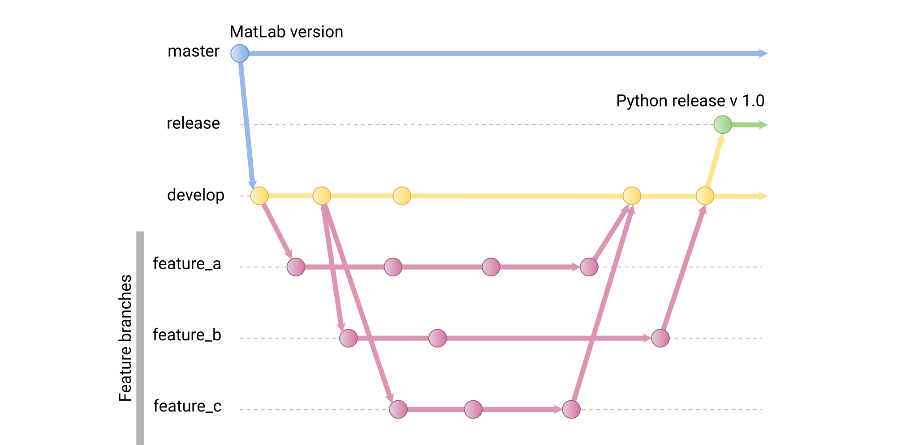

# PyMI-IPA
This repository contains a Python version of the Matlab MI-IPA implementation ([GitHub](https://github.com/anneflo/MI_IPA)): "Inferring interaction partners from protein sequences using mutual information", by Anne-Florence Bitbol ([article](https://doi.org/10.1371/journal.pcbi.1006401)).

---
<!--ts-->
   * [PyMI-IPA](#pymi-ipa)
      * [What we know so far](#what-we-know-so-far)
         * [Input](#input)
            * [Standard_HKRR_dataset.fasta](#standard_hkrr_datasetfasta)
            * [SpeciesNumbering_Standard_HKRR_dataset.mat](#speciesnumbering_standard_hkrr_datasetmat)
         * [Output](#output)
            * [IniScrambling_Ninc1600_rep1.txt](#iniscrambling_ninc1600_rep1txt)
            * [Resf_Ninc1600_rep1.txt](#resf_ninc1600_rep1txt)
            * [TP_data_Ninc1600_rep1.txt](#tp_data_ninc1600_rep1txt)
      * [Contributing](#contributing)
         * [Workflow](#workflow)
         * [Setting up your local repository](#setting-up-your-local-repository)
         * [Start coding](#start-coding)
         * [Dependencies](#dependencies)

<!-- Added by: agu, at: vie mar 20 22:10:10 CET 2020 -->

<!--te-->

---
## What we know so far
### Input
#### Standard_HKRR_dataset.fasta
MSA in fasta format (5109 random pairs). First sequence is the reference, last a dummy sequence.
Names look like this:  
>\>Halhy_2679_HK_Classic|Haliscomenobacter_hydrossis_DSM_1100|Pair_Halhy_2678|HisKA_202-269/Halhy_2678_RR_unclassified|Haliscomenobacter_hydrossis_DSM_1100|Pair_Halhy_2679|Response_reg_6-118  
> 
>\>Halhy_3192_HK_Classic|Haliscomenobacter_hydrossis_DSM_1100|Pair_Halhy_3191|HisKA_204-270/Halhy_3191_RR_OmpR|Haliscomenobacter_hydrossis_DSM_1100|Pair_Halhy_3192|Response_reg_5-115

We should somehow input the info about the length of each sequence pair in the alignment (Probably best if given as an argument).

#### SpeciesNumbering_Standard_HKRR_dataset.mat

Sp. Index | Sp. name
------------ | -------------
1 | Acetohalobium_arabaticum_DSM_5501
2 | Carboxydothermus_hydrogenoformans_Z-2901
3 | Vibrio_cholerae_MJ-1236
4 | Rickettsia_rickettsii_str._Hino
5 | Serratia_marcescens_WW4
6 | Bacillus_cereus_AH820
7 | Escherichia_coli_CFT073

**502** Species in total. Made a .csv version for us.

### Output 
(from MatLab, see [results.zip](results.zip))
#### IniScrambling_Ninc1600_rep1.txt

Sp. Index | Seq nº | Sp. Index | Seq nº
:------------: | :-------------: | :-------------: | :-------------:
491 | 4948 | 491 | 4949
491 | 4949 | 491 | 4944
491 | 4950 | 491 | 4947
491 | 4951 | 491 | 4936
492 | 4952 | 492 | 4955
492 | 4953 | 492 | 4956
492 | 4954 | 492 | 4954

Probably random pairs (**5064**), not final result.

#### Resf_Ninc1600_rep1.txt

Sp. Index | Seq nº | Seq nº | Score x? | Score y?
:------------: | -------------: | -------------: | :-------------: | :-------------:
1 | 2 | 2 | -822.35 | 452.64
1 | 3 | 3 | -705.42 | 452.64
2 | 4 | 7 | -769.9 | 136.96
2 | 5 | 5 | -301.21 | 359.58
... | ... | ... | ... | ...
502 | 5105 | 5105 | -605.18 | 385.49
502 | 5106 | 5108 | -409.19 | 152.64
502 | 5107 | 5107 | -285.82 | 457.96
502 | 5108 | 5098 | -270.35 | 134.47

Contains **5064** lines with the final pairs (**5109** pairs in the input fasta). We will have to match this seq. nº to the ones in the input fasta to generate a nicer output (table).  

#### TP_data_Ninc1600_rep1.txt

Nº of pairs? | ? | ? | ? | ? | ?
------------ | ------------- | ------------- | ------------- | ------------- | -------------
0 | 4452.3 | 872 | 4192 | 0 | 0
1600 | 1511 | 1455 | 3609 | 256 | 1344
3200 | 2240.5 | 1737 | 3327 | 1043 | 2157
4800 | 3014 | 1913 | 3151 | 1690 | 3110
5064 | 3156.3 | 2040 | 3024 | 1913 | 3151

Output matrix (MI_IPA_main.m: lines 102-104)

---
## Contributing
### Workflow
If you're interested in contributing to this project, please follow the following guidelines. Our main branch, where all changes will be gathered, is called **"develop"**. Every "feature" (function) will have its own branch and once is finished, the **"feature_branch"** will be merged to **"develop"**. The branch **"master"** contains the original matlab version. The pending tasks are managed within **Issues**.
  

### Setting up your local repository
1. Clone the repository  
```bash
git clone git@github.com:ElofssonLab/MI_IPA.git
```
or use the https version if you are not using SSH keys  
```bash
git clone https://github.com/ElofssonLab/MI_IPA.git
```
1. Check current (local) branch  
```bash
git branch
```
2. Check existing remote branches  
```bash
git branch -r
```
3. Now you can collaborate in an existing branch or create a new one  
- Create and switch to a new branch  
```bash
git checkout -b <my_new_branch>
```
   - Or download an existing branch ("MI_IPA_main.py" as an example)  
```bash
git fetch origin MI_IPA_main.py:MI_IPA_main.py
```
   Switch to the downloaded branch  
```bash
git checkout MI_IPA_main.py
```

### Start coding
Create the file (__*"my_code.py"*__) with the code in the repository directory.  
Go to the directory.  
```bash
cd <path to directory>
```
Verify working branch  
```bash
git branch
```
List files/directories modified locally  
```bash
git status
```
Add to the stage your file  
```bash
git add my_code.py
```
Commit the changes  
```bash
git commit -m "Added my code"
```
Every commit creates a "snapshot" ([GitHub advice about commits](https://github.com/trein/dev-best-practices/wiki/Git-Commit-Best-Practices))

To finally send your commits to the remote:  
```bash
git push
```

If is your first push to a newly created branch you will get this error:
> fatal: The current branch my_new_branch has no upstream branch.  
> To push the current branch and set the remote as upstream, use  
> git push --set-upstream origin my_new_branch  

So:  
```bash
git push --set-upstream origin my_new_branch
```
--- 
### Dependencies
* numpy
* scipy
* biopython
* pandas
* munkres  

Install with:
```bash
pip3 install numpy scipy biopython pandas munkres
```
