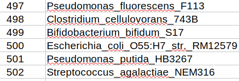
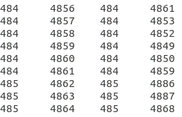
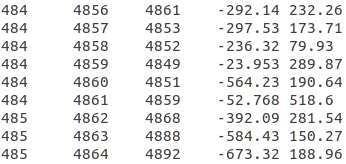
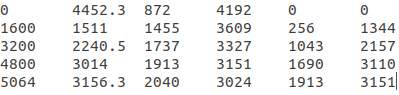

This repository contains a Python version of the Matlab MI-IPA implementation ([GitHub](https://github.com/anneflo/MI_IPA)): "Inferring interaction partners from protein sequences using mutual information", by Anne-Florence Bitbol ([article](https://doi.org/10.1371/journal.pcbi.1006401)).

# What we know so far
### Input
- Standard_HKRR_dataset.fasta
MSA in fasta format (random pairs)
- SpeciesNumbering_Standard_HKRR_dataset.mat
        
A MatLab list including an index and the species name

### Output (from MatLab, see results.zip)
1. IniScrambling_Ninc1600_rep1.txt
        

1. Resf_Ninc1600_rep1.txt
         

1. TP_data_Ninc1600_rep1.txt
        

### MatLab files
##### MI_IPA_main.m
Main program

## TODO:
[X] Create readme for our project
[-] Translate main script (@lllovej)
[-] Translate sub-scripts
[-] Clean (delete) old MatLab code

# Contributing
If you're interested in contributing to this project, please follow the following guidelines. Our main branch, where all changes will be gathered, is called **"develop"**. Every "feature" (function) will have its own branch and once is finished, the **"feature_branch"** will be merged to **"develop"**.

#### Setting up your local repository
1. Clone the repository
```git clone git@github.com:ElofssonLab/MI_IPA.git```
or the https if you are not using SSH keys
```git clone https://github.com/ElofssonLab/MI_IPA.git```
1. Check current (local) branch
```git branch```
1. Check existing remote branches
```git branch -r```

1. Now you can collaborate in an existing branch or create a new one
-- Create and switch to a new branch 
```git checkout -b <my_new_branch>```
-- Or download an existing branch ("MI_IPA_main.py" as an example)
```git fetch origin MI_IPA_main.py:MI_IPA_main.py```
Switch to the downloaded branch
```git checkout MI_IPA_main.py```
#### Start coding
Create the file (__*"my_code.py"*__) with the code in the repository directory. 
Go to the directory.
```cd <path to directory>```
Verify working branch
```git branch```
List files/directories modified locally
```git status```
Add to the stage your file
```git add my_code.py```
Commit the changes
```git commit -m "Added my code"```
Every commit creates a "snapshot" ([GitHub advice about commits](https://github.com/trein/dev-best-practices/wiki/Git-Commit-Best-Practices))
To finally send your commits to the remote:
```git push```
If is your first push to a newly created branch you will get this error:
> fatal: The current branch my_new_branch has no upstream branch.
To push the current branch and set the remote as upstream, use
git push --set-upstream origin my_new_branch

So:
```git push --set-upstream origin my_new_branch```

